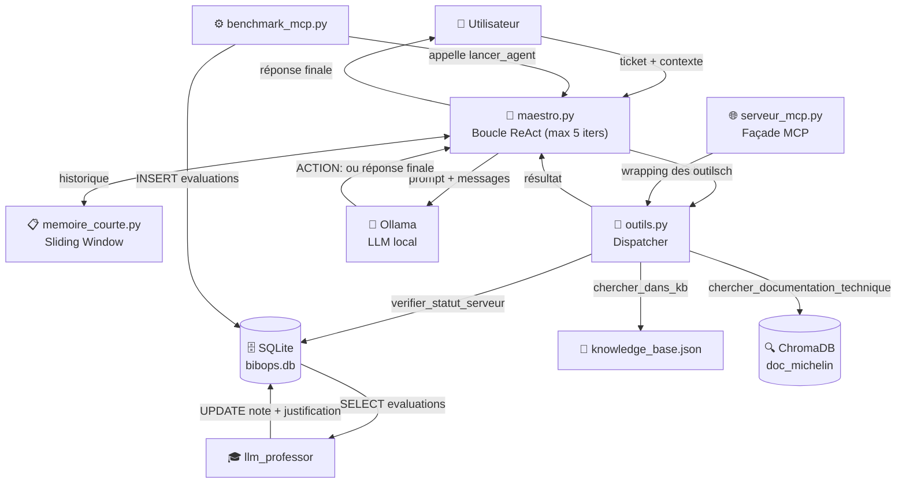

# ARCHITECTURE — BibOps

> Document de référence — rédigé le 6 mars 2026.
> BibOps est un agent IA de support informatique autonome développé pour Michelin, dans le cadre d'un projet ENSIMAG / Aginux.

---

## Table des matières

1. [🎯 Vue d'ensemble de l'Architecture](#1--vue-densemble-de-larchitecture)
2. [🔄 Flux d'Interaction — Qui fait quoi avec qui](#2--flux-dinteraction--qui-fait-quoi-avec-qui)
3. [📂 Description Détaillée des Fichiers](#3--description-détaillée-des-fichiers)
4. [🔌 Le Protocole MCP (Model Context Protocol)](#4--le-protocole-mcp-model-context-protocol)

---

## 1. 🎯 Vue d'ensemble de l'Architecture

### But du projet

BibOps est un **agent IA de support IT autonome** conçu pour les techniciens et utilisateurs de Michelin. Son rôle est d'analyser des tickets de support en langage naturel et de fournir une réponse technique précise, en mobilisant de façon autonome les bonnes sources d'information (base de données de statuts, base de connaissances structurée, et documentation technique vectorisée).

L'agent est entièrement **local et souverain** : il ne dépend d'aucune API cloud. Les LLMs (phi3, llama3.2…) tournent localement via **Ollama**, les données sont stockées en local dans **SQLite** et **ChromaDB**.

---

### Grandes briques logiques

| Brique | Rôle | Fichier(s) principal(aux) |
|---|---|---|
| **Le Cerveau / Agent** | Orchestre la réflexion (ReAct), décide quel outil appeler, formule la réponse finale. | `maestro.py` |
| **La Mémoire** | Conserve le fil de la conversation (sliding window) pour contextualiser chaque appel LLM. | `memoire_courte.py` |
| **Les Outils** | Fonctions Python spécialisées pour interroger les données. Exposables nativement ou via MCP. | `outils.py`, `serveur_mcp.py` |
| **Les Données** | Bases de données opérationnelles (SQLite, ChromaDB) + KB brute source (articles Michelin, docs). | `data/databases/`, `data/knowledge_base/` |
| **L'Évaluation** | Pipeline de test automatisé de l'agent + notation des réponses + analyse de cause racine. | `benchmark_mcp.py`, `rca_engine.py`, `evaluation_manager.py` |

---

## 2. 🔄 Flux d'Interaction — Qui fait quoi avec qui

### Cycle de vie d'une requête

```
1. L'utilisateur soumet un ticket en langage naturel
         │
         ▼
2. maestro.py :: lancer_agent(contexte, ticket, outils_disponibles, modele)
   ├── Construit le system_prompt avec la liste des outils et leurs docstrings
   ├── Lit l'historique via memoire_courte.py (sliding window, max 50 messages)
   └── Envoie le tout à Ollama (LLM local)
         │
         ▼
3. Ollama réfléchit (Chain of Thought) et répond soit :
   ┌─────────────────────────────────────────────────┐
   │  Cas A : ACTION: nom_outil("argument")           │  ←── L'agent veut une information
   │  Cas B : réponse finale en prose                 │  ←── L'agent a tout ce qu'il faut
   └─────────────────────────────────────────────────┘
         │ (Cas A)
         ▼
4. maestro.py parse la directive ACTION: avec une regex
   └── Dispatche vers l'outil correspondant dans outils.py :
       ├── verifier_statut_serveur(nom)  →  SQLite (bibops.db, table serveurs_it)
       ├── chercher_dans_kb(requete)     →  knowledge_base.json (scoring mots-clés)
       └── chercher_documentation_technique(mot_cle) → ChromaDB (recherche vectorielle)
         │
         ▼
5. Le résultat de l'outil est réinjecté dans l'historique de conversation
   └── Retour à l'étape 3 (max 5 itérations)
         │
         ▼
6. L'agent formule sa réponse finale → retournée à l'utilisateur
```

---

### Diagramme de communication



> **Note :** `serveur_mcp.py` est une **façade** — il n'appelle pas `maestro.py` directement. Il expose les fonctions d'`outils.py` à des clients MCP externes (Claude Desktop, Cursor…).

---

## 3. 📂 Description Détaillée des Fichiers

### `src/agents/` — Le cœur de l'agent

#### `maestro.py`
**Rôle :** Orchestrateur principal du système. Expose la fonction `lancer_agent(contexte, ticket_utilisateur, outils_disponibles, modele)`.

Implémente le paradigme **ReAct** (_Reason + Act_) :
- Génère dynamiquement le `system_prompt` en lisant les docstrings des fonctions passées dans `outils_disponibles`.
- Boucle sur un maximum de **5 itérations** : envoie le prompt à Ollama, détecte une directive `ACTION: nom_outil("arg")` via regex, exécute l'outil, réinjecte le résultat, recommence.
- Si aucune directive n'est détectée, la réponse du LLM est retournée comme réponse finale.
- Si la limite d'itérations est atteinte, renvoie un message de fallback invitant à escalader.

**Dépend de :** `memoire_courte.py`, `outils.py`, `ollama` (LLM local).

---

#### `memoire_courte.py`
**Rôle :** Gestion de la mémoire conversationnelle à court terme.

Implémente la classe `MemoCourTerme` avec une stratégie de **fenêtre glissante** : l'historique est limité à `max_messages` entrées (défaut : 50). Au-delà, les messages les plus anciens sont supprimés. L'historique est structuré en liste de `{role, content}` compatible Ollama.

**Dépend de :** rien (module autonome).

---

#### `outils.py`
**Rôle :** Bibliothèque des outils d'interrogation des données. Fournit les trois fonctions que l'agent peut invoquer.

| Fonction | Source | Logique |
|---|---|---|
| `verifier_statut_serveur(nom_serveur)` | SQLite — `serveurs_it` | Recherche exacte, puis partielle par mots du nom. |
| `chercher_dans_kb(requete)` | `knowledge_base.json` | Scoring : +2 par mot-clé trouvé, +1 si le problème contient un mot de la requête. Retourne le top 3. |
| `chercher_documentation_technique(mot_cle)` | ChromaDB — `doc_michelin` | Requête vectorielle sémantique. Rejette les résultats avec distance cosinus > 1.5. |

Le client ChromaDB est instancié en **singleton de module** pour éviter les reconnexions répétées.

**Dépend de :** `sqlite3`, `chromadb`, `data/databases/bibops.db`, `data/databases/vectordb`, `data/knowledge_base/knowledge_base.json`.

---

#### `serveur_mcp.py`
**Rôle :** Exposition des outils via le protocole MCP. Voir la [section dédiée](#4--le-protocole-mcp-model-context-protocol).

---

#### `baseSQL.py`
**Rôle :** Script d'**initialisation idempotente** de la base SQLite `data/databases/bibops.db`.

Crée (si elles n'existent pas) les trois tables :
- `serveurs_it` (nom, statut, date) — données opérationnelles sur les services IT.
- `tickets` (id, contexte, texte_utilisateur) — tickets de test pour le benchmark.
- `evaluations` (id, ticket_id, modele, reponse_ia, temps_reponse_s, note_juge, justification_juge) — résultats du benchmark.

Seed les données de référence (VPN, CISCO, Outlook) et les tickets de test de façon sécurisée (vérifie si la table est vide avant d'insérer).

**À exécuter une seule fois** avant de lancer l'agent ou le benchmark.

---

#### `memoire_RAG.py`
**Rôle :** Script d'**ingestion documentaire** dans ChromaDB.

Parcourt deux sources :
1. `data/knowledge_base/articles/` — les articles officiels Michelin (un `article.md` par dossier `KB…`).
2. `data/knowledge_base/doc_md/` — les documentations techniques complémentaires (`.md`).

Supprime et recrée la collection `doc_michelin` à chaque exécution pour garantir la cohérence. **À ré-exécuter** si la KB source est mise à jour.

---

### `src/llm_professor/` — Évaluation et analyse

#### `rca_engine.py`
**Rôle :** Module de **Root Cause Analysis (RCA)**. Implémente la classe `RCAEngine` qui envoie un prompt structuré à Ollama pour identifier la cause technique d'un ticket et extraire le service concerné (VPN, CISCO, Outlook…).

Post-traite la réponse LLM pour n'en conserver que les lignes `CAUSE :` et `MOT-CLÉ :`.

> Ce module est actuellement **commenté** dans `maestro.py` mais pleinement fonctionnel. Il est prévu pour s'insérer avant la boucle ReAct, afin d'enrichir le `system_prompt` avec une pré-analyse du ticket.

---

#### `evaluation_manager.py`
**Rôle :** Collecte de **feedback humain ou automatisé** sur les réponses de l'agent.

La fonction `sauvegarder_evaluation(ticket, diagnostic, reponse, note)` horodate et persiste chaque évaluation dans `feedback_log.json` avec un score binaire (`UTILE` / `INUTILE`). Ce fichier est exploitable pour analyser la qualité de l'agent dans le temps.

---

### `src/benchmark/` — L'usine de tests

#### `benchmark_mcp.py` _(principal)_
**Rôle :** Pipeline d'évaluation **bout en bout** de l'agent. Orchestre :
1. Lecture des tickets de test depuis SQLite (`SELECT … FROM tickets`).
2. Exécution de `maestro.lancer_agent()` pour chaque ticket, mesure de la latence.
3. Sauvegarde des résultats dans la table `evaluations` (note initialisée à 0, en attente de notation par le `llm_professor`).

Teste la **pipeline complète** : LLM + boucle ReAct + outils + bases de données.

#### `benchmark.py` _(léger)_
**Rôle :** Benchmark simplifié qui appelle Ollama **directement** (sans agent ni outils), depuis un CSV de tickets. Sert à mesurer les capacités brutes d'un modèle LLM, sans l'overhead de la logique agent. Les résultats sont sauvegardés dans `data/benchmark/tickets_evalues.json`.

---

### `data/` — La couche de données

La séparation fondamentale est **sources vs générés** :

```
data/
├── knowledge_base/       ← SOURCES — à versionner dans Git
│   ├── articles/         ← Articles KB officiels Michelin (KB0010356, KB0010426…)
│   ├── doc_md/           ← Documentation technique (VPN, standards…)
│   └── knowledge_base.json  ← KB structurée (mots-clés, solutions, escalade)
│
├── benchmark/            ← DONNÉES DE TEST — à versionner dans Git
│   ├── tickets_scenario_1.csv
│   └── tickets_evalues.json
│
└── databases/            ← GÉNÉRÉS — à ignorer dans .gitignore
    ├── bibops.db         ← SQLite (reconstruit par baseSQL.py)
    └── vectordb/         ← ChromaDB (reconstruit par memoire_RAG.py)
```

> **Règle :** `databases/` est listé dans `.gitignore`. Ces fichiers sont reconstruits localement par les scripts d'initialisation.

---

### `docs/` — Notebooks d'analyse

| Notebook | Contenu |
|---|---|
| `analyse_d_AGENT_ia.ipynb` | Exploration qualitative des réponses de l'agent. |
| `METRICS_du_projet.ipynb` | Visualisation des métriques de benchmark (latences, scores, comparaison de modèles) depuis la table `evaluations` de SQLite. |

---

## 4. 🔌 Le Protocole MCP (Model Context Protocol)

### Problème résolu

Les fonctions de `outils.py` sont des fonctions Python ordinaires, appelables uniquement depuis du code Python. Pour les rendre accessibles à des clients externes compatibles MCP (Claude Desktop, Cursor, n'importe quel agent tiers), il faut les "brancher" sur une interface standardisée.

### Solution : `serveur_mcp.py`

`serveur_mcp.py` est une **couche d'adaptation pure** — il ne contient aucune logique métier propre. Il utilise la bibliothèque `FastMCP` pour déclarer les outils de `outils.py` comme des endpoints MCP :

```python
from mcp.server.fastmcp import FastMCP
from src.agents.outils import verifier_statut_serveur, chercher_documentation_technique, chercher_dans_kb

mcp = FastMCP("Michelin_IT_Tools")

@mcp.tool()
def mcp_verifier_statut_serveur(nom_serveur: str) -> str:
    """Vérifie l'état d'un serveur dans la base de données SQLite."""
    return verifier_statut_serveur(nom_serveur)

# … idem pour les deux autres outils

mcp.run_stdio_async()
```

### Ce que ça apporte

| Sans MCP | Avec MCP |
|---|---|
| Les outils ne sont utilisables que depuis `maestro.py` via Python. | N'importe quel client MCP peut découvrir et appeler les outils de façon standardisée. |
| L'agent BibOps est une application monolithique. | BibOps devient un **serveur d'outils IT** réutilisable par d'autres agents ou interfaces. |

### Transport

Le serveur fonctionne en mode **`stdio` asynchrone**, ce qui est le transport standard pour MCP en mode développement local. Un client MCP lance simplement le processus `serveur_mcp.py` et communique avec lui via stdin/stdout.

---

*Document généré le 6 mars 2026 — BibOps v0.1.0*
