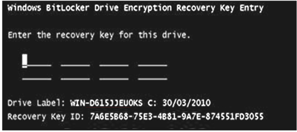

**Summary**

This article will provide steps by step instructions for how to deal with a user's laptop which has been locked out by BitLocker.

**Symptoms**

At start, a**BitLocker**screen appears where user is unable to login

**Solution**

Provide the user with the challenge key to unlock BitLocker on their machine.

**Details**

**IMPORTANT:**

- **Never copy-paste into the Incident / attach any screenshot of the user's BitLocker details**
- BitLocker blade can be found through Entra ID (aka- Azure portal) or Intune portal.
- Pay attention to the subcategory of the BitLocker template. It automatically sets to "User down" and this subcategory implies that the ticket should be resolved in the same day. In case the user is in home office, please make sure they are willing/able to go to the office in the same day, otherwise do not use this category.

**Before trying any option**,

- User**MUST**be validated via**Security Questions**
- In the case of a shared or production machine**site approvers**must contact and verify Security questions for the BitLocker PIN.
- Please ask the user to**remove ANY peripheral**(USB, Smartcard, token, mouse, external keyboard....) and to**reboot**the computer.

|  | **Method 1- Retrieve BitLocker key without PC’s hostname**  |
| --- | --- |

| *Steps*  | *Actions*  | *Illustrations*  |
| --- | --- | --- |
| **1**  | You can retrieve the bit-locker key by asking the user to provide the BitLocker key ID is a 32-digit key of the key ID displayed on his screen.  |   |
| **2**  | Login to the Entra ID portal with your Intune admin account**:**click on the link below to launch the portal or open[https://entra.microsoft.com/](https://entra.microsoft.com/)in the browser**[Entra ID portal](https://entra.microsoft.com/#home)** - Click on the devices tab in the left panel
- You will see the BitLocker portal options in the upcoming blade |   |
| **3**  | Ask the user for the BitLocker key ID - a 32-digit keyand enter it on the search bar, then the device info will be populated.  |   |
| **4**  | The**Recovery Password**will be populated, and you can provide it to the user, confirming with user all digits are taken correctly.  |   |

|  | **METHOD 2 -Retrieve BitLocker key WITH PC’s hostname**  |
| --- | --- |

| *Steps*  | *Actions*  | *Illustrations*  |
| --- | --- | --- |
| **1**  | - **ALTERNATIVELY**, we can find the BitLocker key of system via Intune portal with the help of the device hostname.Login to the Intune portal with your Intune admin account**:**click on the link below to launch the portal or open[https://intune.microsoft.com](https://intune.microsoft.com/#home)in the browser**[Intune Portal](https://intune.microsoft.com)** |   |
| **2**  | in the Intune portal, follow the following process to reach to devices blade. - Click on the "devices" tab & then go to "all devices" tab
- search the device hostname in the search box

This will populate the device data on the console screen  |   |
| **3**  | On the searched device, go to the "recovery keys" tab  |   |
| **4**  | On the recovery keys tab click on the "show recovery key" option  |   |
| **5**  | After clicking on"show recovery key" you will see the recovery key on the right panel  |   |

**If the Recovery Key cannot be found**, using both methods, then run the BitLocker remediation script on the system via following steps.

| *Steps*  | *Actions*  | *Illustrations*  |
| --- | --- | --- |
| **1**  | - Login to the Intune portal with your Intune admin account**:**click on the link below to launch the portal or open[https://intune.microsoft.com](https://intune.microsoft.com/#home)in the browser**[Intune Portal](https://intune.microsoft.com)** |   |
| **2**  | In the Intune portal, follow the following process to reach to devices blade. - Click on the "devices" tab & then go to "all devices" tab
- search the device hostname in the search box

This will populate the device data on the console screen  |   |
| **3**  | On the overview page select the more options by clicking on three dots in the right corner and then click on run remediation (preview)  |   |
| **4**  | Search for the BitLocker script "SCRIPT-WIN-Remediation-BitLocker-Key-migration" Select the script and click on run remediation - wait for 5 minutes and the BitLocker key will reflect on the Intune portal (the system should be active and connected to internet)  |   |
| **5**  | You will see the BitLocker key on the Intune portal again in this path  |   |

**If the Recovery Key still cannot be found**, using all the above methods,**assign the incident to OSS. (**machine may need to be re-imaged**)**

If you assign the incident to**OSS**, please make sure you add the following information:

- Machine name/Host name- Model- What was user doing before BitLocker was triggered?- Were any USB devices plugged in (other than keyboard/mouse)- Was machine shut down or in sleep before the trigger?

**Service offering**

WORKPLACE-MDE-EndpointSecurity

